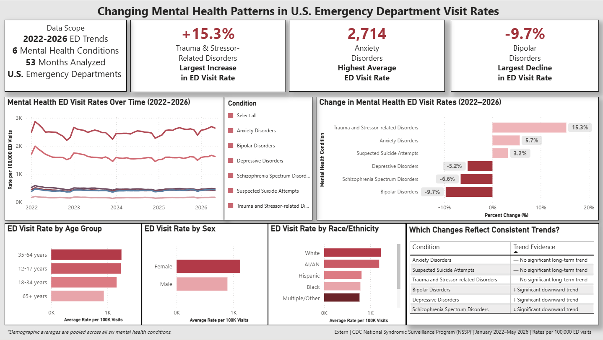

# Mental Health in Crisis: Changing Patterns in U.S. Emergency Departments

### Exploratory Data Analysis of Mental Health-Related Emergency Department Visit Rates \| 2022--2026

This project analyzes national emergency department (ED) visit rates for
six major mental health conditions using data from the **CDC National
Syndromic Surveillance Program (NSSP)**.

Using **Python, exploratory data analysis, data visualization,
demographic analysis, endpoint growth calculations, and simple linear
regression**, the project examines how mental health-related ED
utilization changed from **January 2022 through May 2026**.

## Research Question

**How did emergency department visit rates for major mental health
conditions change between January 2022 and May 2026, and which
conditions exhibited the largest observed changes?**

## Why This Analysis Matters

Emergency departments operate under significant capacity constraints,
and mental health-related visits can require specialized evaluation,
treatment, or placement. Understanding which mental health conditions
are changing most can help healthcare organizations identify areas that
may warrant closer monitoring and support staffing, behavioral health
service planning, psychiatric capacity decisions, and public health
surveillance.

This analysis does **not** establish that changes in individual mental
health conditions cause ED crowding. Instead, it provides a data-driven
view of how the composition of mental health-related ED utilization
changed over time.

## Key Findings

### 1. Trauma and Stressor-related Disorders had the largest endpoint increase

From January 2022 to May 2026:

  Condition                                 Percent Change
  --------------------------------------- ----------------
  Trauma and Stressor-related Disorders         **+15.3%**
  Anxiety Disorders                              **+5.7%**
  Suspected Suicide Attempts                     **+3.2%**
  Depressive Disorders                           **−5.2%**
  Schizophrenia Spectrum Disorders               **−6.6%**
  Bipolar Disorders                              **−9.7%**


**Takeaway:** Trauma and Stressor-related Disorders experienced the
largest relative endpoint increase, while Bipolar Disorders experienced
the largest relative decline.

### 2. Conditions followed different monthly patterns


Anxiety Disorders had the highest overall visit rate throughout the
analysis and the greatest month-to-month variability. The visualization
also shows why comparing only January 2022 with May 2026 can be
misleading: substantial fluctuations occurred between those endpoints.

### 3. Endpoint growth did not necessarily indicate a sustained upward trend

To determine whether changes represented a consistent direction across
the full monthly series, a separate simple linear regression was fit for
each condition.


Although **Trauma and Stressor-related Disorders** and **Anxiety
Disorders** ended May 2026 above their January 2022 levels, neither
showed a statistically significant positive linear trend:

-   Trauma and Stressor-related Disorders: **p = 0.114**
-   Anxiety Disorders: **p = 0.503**
-   Suspected Suicide Attempts: **p = 0.208**

This suggests that endpoint increases should not automatically be
interpreted as evidence of a sustained upward trend.

### 4. Three conditions showed statistically significant downward trends

I used a significance level of 0.05, which is a commonly used threshold in statistical analysis. 
It means I required the p-value to be below 0.05 before considering a trend statistically significant.
In practical terms, this limits the probability of rejecting the null hypothesis when it is actually true to 5%.

The regression analysis identified significant negative linear trends
for:

-   **Depressive Disorders:** slope = −2.90 rate points/month, p =
    0.0004
-   **Bipolar Disorders:** slope = −1.22 rate points/month, p \< 0.001
-   **Schizophrenia Spectrum Disorders:** slope = −0.45 rate
    points/month, p = 0.021

Depressive Disorders had the steepest estimated decline over the study
period.

### 5. Anxiety Disorders had the highest average ED visit rate

Across the national condition-level observations:

-   **Anxiety Disorders:** mean rate ≈ **2,714 per 100,000 ED visits**
-   **Depressive Disorders:** mean rate ≈ **1,822**
-   **Suspected Suicide Attempts:** mean rate ≈ **152**, the lowest
    among the six conditions

## Supporting Demographic Findings

Demographic analysis was used as supporting descriptive context rather
than as the primary research question.

Across all six conditions and available months:

-   **Age:** Ages 12--17 had the highest mean ED visit rate among
    summarized age groups.
-   **Sex:** Females had a higher mean rate than males.
-   **Race/Ethnicity:** White observations had the highest mean rate,
    followed by AI/AN observations, while Asian observations had the
    lowest mean rate.

Because these summaries pool multiple conditions, they should be
interpreted as broad descriptive patterns rather than condition-specific
or causal comparisons.

## Dataset

**Source:** CDC National Syndromic Surveillance Program (NSSP) ---
Mental Health-Related Emergency Department Visit Rates

The raw dataset contained **10,591 rows** and five variables:

  -----------------------------------------------------------------------
  Variable                            Description
  ----------------------------------- -----------------------------------
  `month_end`                         Month of observation

  `condition`                         Mental health condition

  `demographics_type`                 Age, sex, race/ethnicity, or total

  `demographics_values`               Specific demographic group

  `rate_per_100000_visits`            Mental health-related ED visits per
                                      100,000 ED visits
  -----------------------------------------------------------------------

The primary condition-level analysis retained:

-   Anxiety Disorders
-   Bipolar Disorders
-   Depressive Disorders
-   Schizophrenia Spectrum Disorders
-   Suspected Suicide Attempts
-   Trauma and Stressor-related Disorders

The aggregate **"Any Mental Health"** category was excluded because it
combines mental health-related visits rather than representing one
individual condition.

## Data Preparation

The analysis included:

-   Checking for missing values and duplicate records
-   Converting `month_end` into datetime format
-   Evaluating potential outliers with the IQR method
-   Separating total-population observations from demographic
    observations
-   Removing aggregate `"All"` rows from demographic subsets
-   Excluding `"Any Mental Health"` from condition-level comparisons
-   Restricting the primary analysis to `demographics_type = "Total"`
-   Filtering the primary study period to January 2022--May 2026

Potential outliers were investigated rather than automatically removed
because many flagged observations reflected genuine differences between
demographic groups rather than obvious data-entry errors.

## Analysis Workflow

``` text
CDC NSSP Dataset
       ↓
Data Inspection
       ↓
Data Cleaning & Validation
       ↓
Overall vs. Demographic Subsets
       ↓
Descriptive Statistics
       ↓
Monthly Trend Analysis
       ↓
Endpoint Growth Analysis
       ↓
Simple Linear Regression
       ↓
Power BI Dashboard & Final Report
```

## Tools & Technologies

-   **Python:** pandas, NumPy, Matplotlib, Seaborn, SciPy
-   **Business Intelligence:** Power BI
-   **Development:** Google Colab, GitHub
-   **Initial data review:** Google Sheets

## Project Deliverables

### 📓 Exploratory Data Analysis

View the complete Python workflow, data preparation, visualizations, and
statistical analysis:

**[View EDA Notebook](notebooks/Mental_Health_ED_EDA.ipynb)**

### 📊 Power BI Dashboard

I developed a Power BI dashboard to summarize the major findings from the analysis, including condition-level trends, endpoint changes, demographic patterns, and evidence of statistically significant long-term trends.



**Dashboard highlights:**
- **+15.3%** — Trauma and Stressor-related Disorders had the largest endpoint increase.
- **2,714 per 100,000 ED visits** — Anxiety Disorders had the highest average ED visit rate.
- **−9.7%** — Bipolar Disorders had the largest endpoint decline.
- The dashboard distinguishes endpoint changes from statistically significant long-term trends.

> Public Power BI publishing is disabled for this project, so the dashboard is displayed above as a portfolio preview.


### 📄 Research Report

Read the complete methodology, findings, limitations, and discussion:

**[View Research Report](reports/Mental_Health_ED_Research_Report.pdf)**

### 🎤 Project Presentation

View a concise presentation of the problem, analytical approach, and
findings:

**[View
Presentation](presentation/Mental_Health_ED_Analytics_Presentation.pdf)**

## Limitations

-   2026 is incomplete; observations are available only through May
    2026.
-   Endpoint percent change is sensitive to the selected start and end
    months.
-   Simple linear regression captures only linear relationships and does
    not model seasonality, nonlinear trends, abrupt changes, or
    autocorrelation.
-   Demographic summaries pool multiple mental health conditions.
-   The analysis is observational and descriptive and does not establish
    causality.

## Future Analysis

Future work could:

-   Extend the time series as additional 2026 data become available
-   Evaluate seasonality and nonlinear trends
-   Examine condition-specific patterns within age, sex, and
    race/ethnicity groups
-   Investigate whether particular demographic populations are driving
    condition-level changes

## Repository Structure

``` text
Mental-Health-ED-Analysis/
│
├── data/
│   ├── raw/
│   └── processed/
│
├── notebooks/
│   └── Mental_Health_ED_EDA.ipynb
│
├── visuals/
│   ├── powerbidashboard.png
│   ├── monthly_ed_visit_trends.png
│   ├── endpoint_percent_change.png
│   └── linear_regression_trends.png
│
├── dashboard/
│   └── Mental_Health_ED_Dashboard.pbix
│
├── reports/
│   └── Mental_Health_ED_Research_Report.pdf
│
├── presentation/
│   └── Mental_Health_ED_Analytics_Presentation.pdf
│
└── README.md
```

## How to Run

1.  Open `notebooks/Mental_Health_ED_EDA.ipynb` in Google Colab.
2.  Confirm the required Python libraries are available.
3.  Load the CDC NSSP dataset.
4.  Select **Runtime → Run all** to reproduce the analysis.

## Author

**Elizsa Montoya**\
B.S. Computer Science\
Data Analytics \| Python \| SQL \| Power BI

*Portfolio project applying exploratory data analysis, statistical
methods, and business intelligence to healthcare utilization data.*
